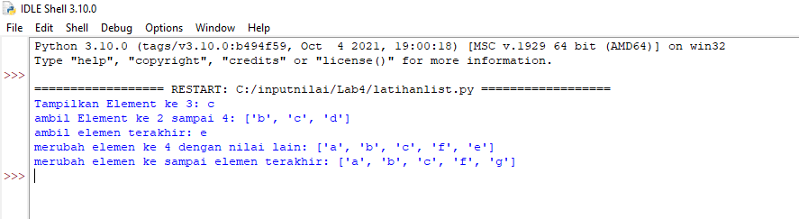
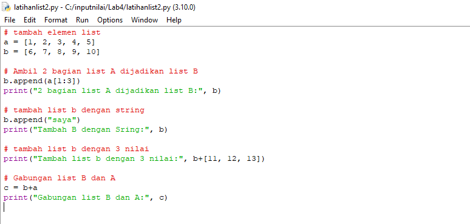
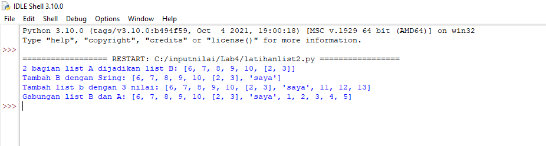
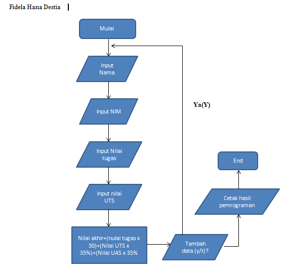
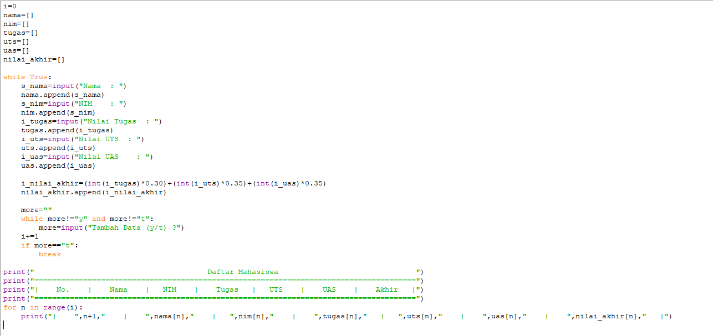

# Lab4
## Latihan 1

 Latihan yang pertama adalah membuat list dengan menuliskan:

 list=[]

 (Keterangan: list dapat diubah nilai lainnya misal list1, atau nama lainnya)

 Berikut ini adalah programnya:

### Akses list

 Kodenya berikut ini:

 list=["a", "b", "c", "d", "e"]

 -Selanjutnya adalah perintah untuk menampilkan elemen ke 3 dalam list gunakan kode sebagai berikut:

 print("Tampilkan Element ke 3:", list[2])

 -Kemudian perintah untuk mengambil elemen ke 2 sampai ke 4 gunakan kode berikut:

 print("ambil Element ke 2 sampai 4:", list[1:4])

 -Dan perintah untuk mengambil elemen terakhir menggunakan kode berikut:

 print("ambil elemen terakhir:", list[5-1]) 

### Merubah elemen ke 4 dengan nilai lain

 -Untuk merubah elemen ke 4 dengan nilai F gunakan kode sebagai berikut:

 list[3] = "f"

 -Lalu tampilkan perubahannya dengan kode berikut:

 print("merubah elemen ke 4 dengan nilai lain:", list)

 -Untuk merubah elemen ke 4 sampai terakhir gunakan kode berikut:

 list[3:] = "f", "g"

 -Ini untuk merubah elemen ke 4 sampai terakhir dengan string "f" dan "g". gunakan kode berikut:

 print("merubah elemen ke sampai elemen terakhir:", list)

### Berikut ini hasil programnya:

### Latihan untuk menambahkan elemen dalam list

 Berikut ini gambar programnya

### tambah elemen list

a=[1,2,3,4,5] b=[6,7,8,9,10]

### diatas adalah untuk membuat 2 list Ambil 2 bagian list A ke list B

b.append(a[1:3]) print("2 bagian List A dijadikan List B:", b)

### diatas adalah code untuk menambahkan list A kedalam list B dengan menggunakan perintah append tambah list b dengan string

b.append("saya") print("Tambah B dengan Sring:", b)

### diatas adalah untuk menambahkan list B dengan string menggunakan append

tambah list b dengan 3 nilai print("Tambah list b dengan 3 nilai:", b+[11,12,13])

### diatas adalah untuk menambahkan list b dengan 3 nilai dengan menggunakan arithmatic + Gabungan List B dan A

c=b+a print("Gabungan list B dan A:", c)

### dan yang di atas ini adalah untuk menggabungkan list B dan list A, menjadi list C

Berikut ini adalah hasil dari programnya:

### Praktikum Lab 4

### Membuat list nilai mahasiswa

 Berikut adalah flowchart programnya sebagai berikut

 Berikut ini adalah gambar programnya:

