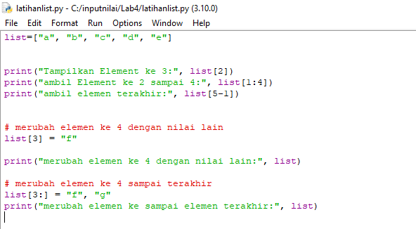

# Lab4
## Latihan 1

 Latihan yang pertama adalah membuat list dengan menuliskan:

 list=[]

 (Keterangan: list dapat diubah nilai lainnya misal list1, atau nama lainnya)

 Berikut ini adalah programnya:

### Akses list

 Kodenya berikut ini:

 list=["a", "b", "c", "d", "e"]

 -Selanjutnya adalah perintah untuk menampilkan elemen ke 3 dalam list gunakan kode sebagai berikut:

 print("Tampilkan Element ke 3:", list[2])

 -Kemudian perintah untuk mengambil elemen ke 2 sampai ke 4 gunakan kode berikut:

 print("ambil Element ke 2 sampai 4:", list[1:4])

 -Dan perintah untuk mengambil elemen terakhir menggunakan kode berikut:

 print("ambil elemen terakhir:", list[5-1]) 

